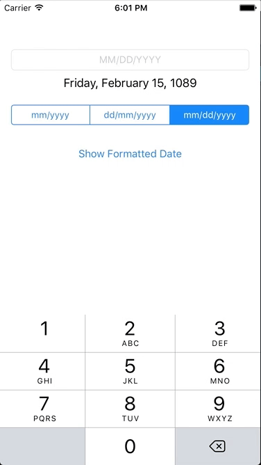

# DateTextField

DateTextField aims to not replace UIDatePicker but to provide an alternative where UIDatePicker may not be the best tool for the job.
In many cases UIDatePicker falls short, especially when you're trying to capture a users birth date. Users can be impatient, and many will just submit the default value of the date picker.

Make it easier for users by allowing them to type in their dates.

DateTextField will handle all the formatting and parsing for you.

## 📝 Requirements
* Swift 5.1
* iOS 10.0+
* Xcode 11

## 🧙‍♂️ Installation

### Manual
Simply drag the DateTextField.swift file into your project.

### Carthage
- Add `github "BeauNouvelle/DateTextField"` to your `Cartfile`

More information on installing and setting up Carthage can be found here:
https://github.com/Carthage/Carthage

### Cocoapods
- Add `DateTextField` to your podfile.
- Add `import DateTextField` to any file where you wish to use it.

## 👩‍💻 Usage

After initialising there's only two properties you really need to take care of.

    myDateTextField.dateFormat = .monthYear
    myDateTextField.separator = "-"

**`dateFormat`**

Currenty supports `.monthYear`, `.dayMonthYear`, and `.monthDayYear` formats.

**`separator`**

Determines what separator you would like to use between date elements. Most common used are dashes `-`, and slashes `/`, but you can use whatever you like.

**`date`**

**set:** Sets the `text` property of `DateTextField` to the supplied date. Formatted as determined by `separator` and `dateFormat`.

**get:** Parses and returns the `text` property as a `Date`. Returns `nil` if text could not be parsed.

Be sure to have a look at the demo project to see it in use.