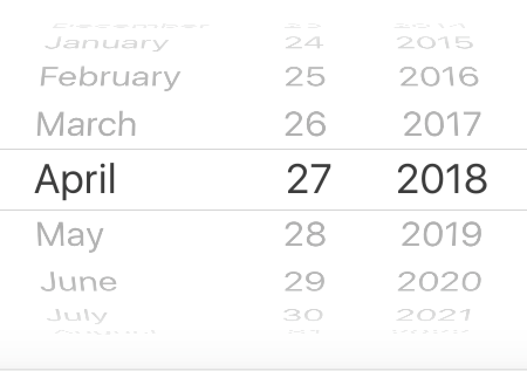

This projects goal is to do for dates what [PhoneNumberKit](https://github.com/marmelroy/PhoneNumberKit) has done for phone numbers.

> **NOTE:** Looking to the Swift community for help to improve this project as it is still in development.

The current date picker isn't appropriate in all cases.

It's limited in customisability, replaces the keyboard, and can be slower than simply typing in a date.

Sometimes you may only want to capture the day and month, or the month and year, such as with credit card expiry dates.

## DateTextField

DateTextField aims to not replace UIDatePicker but to provide an alternative where UIDatePicker may not be the best tool for the job.

## Installation

> This project doesn't currently support Cocoapods or Carthage.

Simply drag the DateTextField.swift file into your project.

## Usage

After initialising there's only two properties you really need to take care of.

    myDateTextField.dateFormat = .monthYear
    myDateTextField.separator = "-"

#### `dateFormat`
Currenty supports `.monthYear`, `.dayMonthYear`, and `.monthDayYear` formats. Would love to support custom formats.

#### `separator`

Determines what separator you would like to use between date elements. Most common used are dashes `-`, and slashes `/`.

#### `date`

**set:** Sets the `text` property of `DateTextField` to the supplied date. Formatted as determined by `separator` and `dateFormat`.

**get:** Parses and returns the `text` property as a `Date`. Returns `nil` if text could not be parsed.

Be sure to have a look at the demo project to see it in use.

 